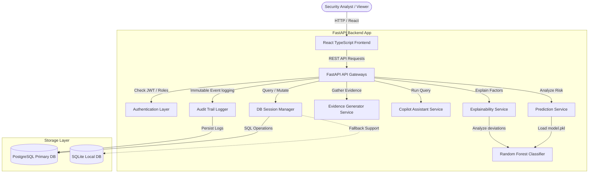

# RiskShield AI — System Architecture

This document describes the high-level architecture, database relationship mappings, and micro-component interfaces for the **RiskShield AI** platform.

---

## System Components & Data Flow

RiskShield AI follows a clean, modular layer architecture, separating presentation logic, business logic, storage engines, and machine learning pipelines.

---

## Core Component Modules

### 1. React Presentation Layer (`frontend/`)
- **Single Page App (SPA)** built with **Vite, React, TypeScript, and Tailwind CSS**.
- **State Management & Querying**: Integrated with **Axios** and custom hooks for token-based REST queries.
- **Charts Visualization**: Implemented using **Recharts** representing volume trends, billing country mismatches, and confusion metrics.
- **Explainability UI**: Renders a circular risk gauge and detailed factor cards with severity weights.
- **RiskShield Copilot**: Renders a floating context-aware assistant panel.

### 2. FastAPI Rest Controllers (`backend/app/routes/`)
- **auth.py**: Controls analyst authentication, credential validation, and JWT generation.
- **transactions.py**: Serves paginated queries for transaction audits and stores Escalations.
- **chargebacks.py**: Compiles evidence packages and logs Dispute Representments.
- **model.py**: Monitors model parameters and runs dynamic threshold simulators.
- **analytics.py**: Aggregate volume and payment charts data.
- **audit.py**: Fetches immutable history log trails.
- **copilot.py**: Processes assistant queries safely.

### 3. Business Service Layer (`backend/app/services/`)
- **prediction.py**: Sanitizes input parameters, encodes categorical columns, and scores transactions using the serialized Random Forest classifier. Falls back to a deterministic rule-based calculation if the model path is unavailable.
- **explainability.py**: Computes mathematical feature deviations against healthy customer averages, scaling them by model importance to output explainable risk contributions.
- **evidence.py**: Audits gateway history, shipping registries, and device overlaps to score dispute winnability.
- **copilot.py**: Implements regex query routing, extracting transaction/dispute records and formatting markdown summaries without cloud hallucinations.

---

## Database Schemas (PostgreSQL / SQLite)

The system maintains 10 primary normalized relational tables:

1. **users**: persist credentials, emails, and permissions (ADMIN, ANALYST, VIEWER).
2. **customers**: holds lifetime checkouts count, failed attempts, and historical chargeback ratios.
3. **transactions**: holds individual checkout criteria (amounts, device fingerprints, countries) and ML risk metrics.
4. **risk_predictions**: tracks probability scores, model versions, and feature contributions.
5. **chargebacks**: stores active dispute cases, deadline, dispute reason code, and evidence strength.
6. **evidence_items**: holds individual gateway authorization documents and shipping validations.
7. **decisions**: stores decisions made by investigators.
8. **audit_logs**: immutable trail log persisting old and new states.
9. **model_versions**: monitors training metrics (Precision, Recall, ROC AUC).
